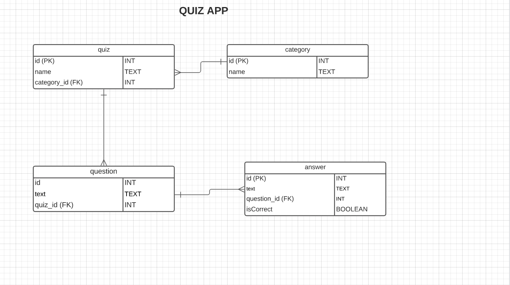

# **Quiz App Spring Back End**

## OBJECTIVE

The goal of Quizzle is to provide a platform that will allow you to not only search through different quizzes, but create your own as well. This app is a REST API that would allow a user to create different quiz questions based on the category of their choosing. This backend app was built using Java, Spring Boot, and PostgreSQL.

#### Links
[Link to FrontEnd](https://github.com/CodingVenus/Quiz-App-FrontEnd) 
[Link to FrontEnd Heroku App](https://quizzle-angular-app.herokuapp.com/)

### TOOLS AND TECHNOLOGIES USED
**DESIGN**
- LUCID CHART

**CODE**
- JAVA
- SPRING BOOT
- SPRING DATA
- MAVEN

**DATABASE**
- POSTMAN
- POSTGRESQL

**DEPLOYMENT**
- HEROKU

## THE PLAN
My goal was to implement full CRUD for each model of this backend application. This also included retreiving resources by the ID of their parent resource.   

I planned to utilize Lombok in order to have the boiler plate code for my getters, setters, and constructors automatiically generated.

### ERD DIAGRAM

## THE PROCESS
For this application, I created the controller mapping of each model individually before going back in and creating their relationships. The Quiz model/table was joined to Category in a many - to - one relationship. Question and Quiz was joined in the same manner, as well as Answer and Question. I think created Get Mappings based on these dependent relationships. For example: Making a GET Request for a list of Quizzes by Category ID. 

When starting on the frontend application for Quizzle I realized there were several REST methods I created that I would not need. For example, there would be no need to get a singular Quiz, Question, or Answer by ID. For the design of the frontend, they would only be need to be returned as a collection based on the ID of their parent resource. 

## CHALLENGES
- I faced multiple issues with properly configuring my Spring Boot application while attempting to deploy to Heroku. Watching [this video](https://www.youtube.com/watch?v=y_idn12FB18) helped me overcome my issues.

## UNFINISHED
- Creating validations for answer and question creation.
- Must redo the PUT methods for each model. 

## USER STORIES -
                                                              
- [Click here](planning/UserStories.txt) to read the User Stories for this project.

# ENDPOINTS
### CATEGORY

| MAPPING | END POINT            |DESCRIPTION
|---------|----------------------|----------------------------|
| GET     | _/api/category/all     | GET ALL CATEGORIES
| GET     | _/api/category/{id}_ | GET CATEGORY BY ID
| POST    | _/api/category/new_      | CREATE CATEGORIES
| DELETE  | _/api/category/{id}_ | DELETE CATEGORY BY 

### QUIZ

| MAPPING | END POINT            |DESCRIPTION
|---------|----------------------|----------------------------|
| GET     | _/api/quiz/all     | GET ALL QUIZZES
| GET     | _/api/category/{id}/quiz/_ | GET QUIZ BY CATEGORY ID
| POST    | _/api/category/{id}/quiz/new_      | CREATE QUIZ BY CATEGORY ID
| DELETE  | _/api/quiz/{id}_ | DELETE QUIZ BY ID

### QUESTION

| MAPPING | END POINT            |DESCRIPTION
|---------|----------------------|----------------------------|
| GET     | _/api/question/all     | GET ALL QUESTIONS
| GET     | _/api/quiz/{id}/question/_ | GET QUESTION BY QUIZ ID
| POST    | _/api/quiz/{id}question/new_      | CREATE QUESTION BY QUIZ ID
| DELETE  | _/api/question/{id}_ | DELETE QUESTION BY ID

### ANSWER

| MAPPING | END POINT            |DESCRIPTION
|---------|----------------------|----------------------------|
| GET     | _/api/answer/all     | GET ALL ANSWERS
| GET     | _/api/question/{id}/answer/_ | GET ANSWER BY QUESTION ID
| POST    | _/api/question/{id}/answer/new_      | CREATE ANSWER BY QUESTION ID
| DELETE  | _/api/answer/{id}_ | DELETE ANSWER BY ID

## FUTURE DELIVERABLES
- Create User and Admin Authentication
